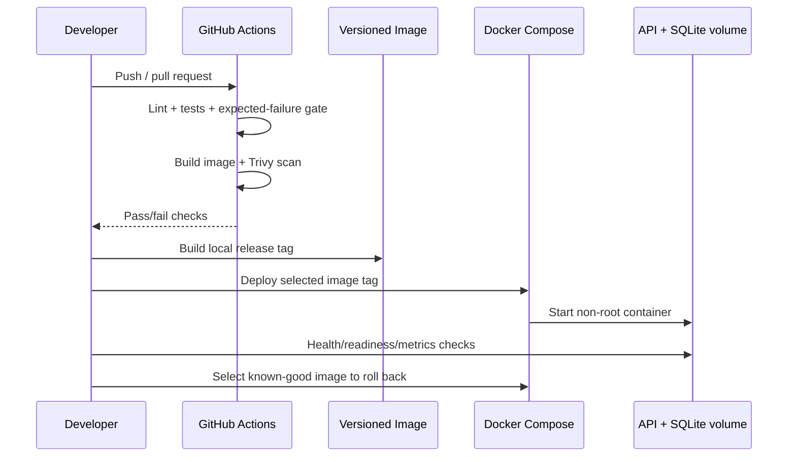

# Architecture and Release Flow

```mermaid
sequenceDiagram
  participant D as Developer
  participant G as GitHub Actions
  participant I as Versioned Image
  participant C as Docker Compose
  participant A as API + SQLite volume
  D->>G: Push / pull request
  G->>G: Lint + tests + expected-failure gate
  G->>G: Build image + Trivy scan
  G-->>D: Pass/fail checks
  D->>I: Build local release tag
  D->>C: Deploy selected image tag
  C->>A: Start non-root container
  D->>A: Health/readiness/metrics checks
  D->>C: Select known-good image to roll back
```

The assessment uses synthetic records only. No Apex production systems, customer data, credentials, or paid cloud services are used.
